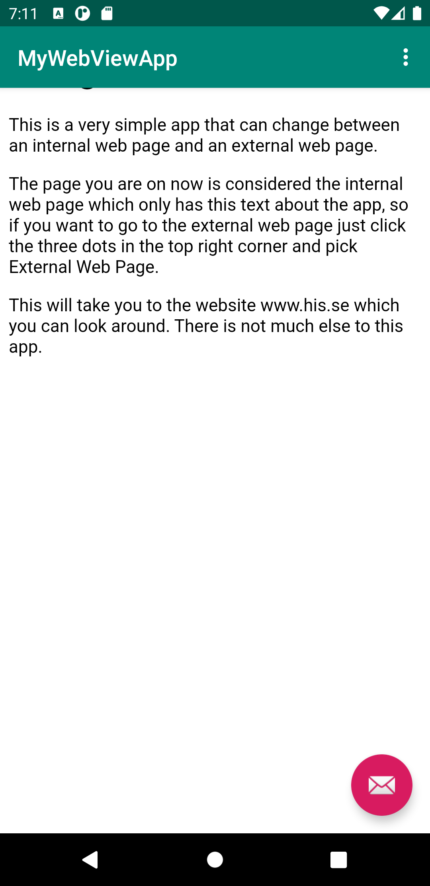
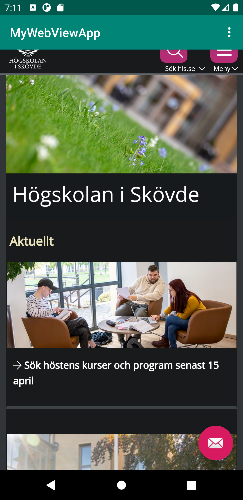

Rapport Assignment 2 WebView

Kod och skärmdumpar



```
if (id == R.id.action_internal_web) {
    Log.d("==>","Will display internal web page");
    showInternalWebPage();
    return true;
}
```

```
public void showInternalWebPage(){
    myWebView.loadUrl("file:///android_asset/about.html");
}
```

Beskrivning av kod
För att få min app att visa upp min lokala sida måste appen först kolla så att använderan har valt att visa upp den lokala sidan, detta görs med en if sats som kollar om id på menyn är internal är eller extenal.
Om id är internal så kallar koden på showInternalWebPage och returnerar ett sant värde. När koden har kallat på showinternalWebPage kommer den köra koden inom det stycket kod vilket innehåller en webview men en url,
denna url:en hänvisas till en fil som heter about.html som är en informations sida om appen och laddar fram den när man startar upp appen.

Diskussion
Utöver att skapa en internal Web Page så har jag också skapat en WebView som ser till att appen kan ladda in hemsidor i sig själv, en Web View Client som gör att hemsidorna som laddas in i Webview syns i själva appen,
istället för att öppna upp chrome appen och ladda den valda hemsidan. Till sist har jag också skapat en External Web View client som laddar in en hemsida i Web View Client, just nu laddar den in his hemsida men kan
bli bytt till vilken hemsidan man än vill att appen ska ladda in.


